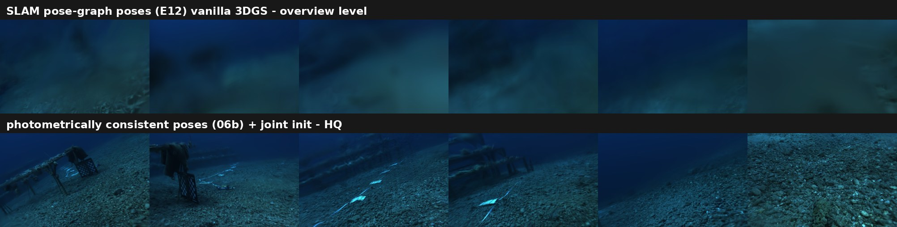

# water — 水下 3D Gaussian Splatting 建图系统 · Time-to-Map

> 研究主线：**在保证地图质量的前提下，最小化"从水下视频到可用 3DGS 地图"的时间。**
> 免离线 COLMAP，在浑水中边采集边建图，并给出免 GT 的米制尺度。

上：常规 SLAM 位姿直接喂 3DGS（概览级）；下：光度一致位姿 + 双输出联合 init（高质量）。
位姿的局部光度一致性是水下 3DGS 画质的第一张入场券。

## 双输出模型（DIRECT：D 深度 + J 去浊）怎么用

| 分支 | 用法 | 效果 |
|------|------|------|
| **D 深度** | **几何初始化桥**：逐帧深度米制定标后反投影成点云，追加进持久高斯地图 | 整条管线**免 COLMAP**，浑水可跑 |
| **D 深度** | **米制源**：全局单参数定标 s_d = median(z/z_direct)，无真值参与 | AQUALOC 轨迹 **1.676 → 0.578 m（−65.5%）** |
| **D 深度** | **压缩调度器**：深度多视角一致性 = 逐高斯置信度，门控 densify | **高斯 −20.4% / 渲染 FPS +15.3%（实测 208→240）**，质量持平 |
| **J 去浊** | **外观初始化 / 紧凑化** | 同 PSNR 高斯更少（低预算档 −37%）；**做几何监督无效** |

## 核心结果（2026-09 冻结口径 · 官方 u8-PSNR · 独占 GPU 计时）

| # | 结果 | 数字 |
|---|------|------|
| ① | **Time-to-Map** | T@0.15 = **698 s**（170 帧，含推理与评测） |
| ② | **预算响应阶梯** | 锐度 retention **0.038 → 0.243 → 0.337**（6.8k / 20.4k / 40.8k iters） |
| ③ | **同 init 离线上限** | batch = **0.426**；增量结构锐度税 ≈0.06，事后不可恢复 |
| ④ | **D-conf 导引压缩** | 高斯 **−20.4%** · FPS **+15.3%** · VRAM −7.5%，质量持平（推荐档 L2） |
| ⑤ | **GT-free 米制化** | **1.676 → 0.578 m（−65.5%）**，sim3_scale 0.57→0.95 ≈ 1 |

**正式措辞（引用请逐字）**：

> 在 DIRECT D-init + 在线位姿 + 增量 3DGS 条件下，系统地测得优化预算是早期地图质量的
> 一阶因素；位姿质量在预算提升后成为进一步限制因素；若干直觉上的
> depth/fusion/densification 调整未显示同量级收益。

不声称"解决了水下 3DGS 核心难点"。

## 调参经验（在线水下 3DGS 的杠杆排序）

1. **优化预算是一阶杠杆**——深度精度/时序一致性/写入策略/预算分配都是二阶；预算 = "质量-时间"旋钮。
2. **预算花在早期**：锐度在早期全视野 densify 中长出（grown, not recovered）；重开窗 = +1.3dB 换 −0.10 锐度，亏本。
3. **位姿要光度一致**（重投影 0.2px vs 16px = 高质量 vs 概览级），轨迹米制精度是另一回事，两者独立。
4. **init 组成**：稀疏 ∪ DIRECT 联合 init 恢复离线锐度 92%；J-init 省高斯，预算越紧收益越大。
5. **FPS 跟可见高斯走**：总高斯 −20% → 可见 −14% → FPS +15%；batch 地图可见少 32% → FPS +21%。
6. **早停看 retention 不看 loss**：PSNR 很早就平台化，锐度还在长——按 loss 早停会停在 0.045（可达 0.243）。

## 导览

- 🌐 **完整报告页（GitHub Pages）**：<https://poiuyjie.github.io/water/> ——
  双输出用法 → 调参经验 → Time-to-Map → 米制化 → 压缩 → 在线 vs 离线账本，全部图表与视频。
- ▶ **全序列渲染视频**：[flythrough_fullseq.mp4](docs/assets/flythrough_fullseq.mp4)
  （1017 帧完整采集轨迹，定稿配方模型逐帧渲染，50s）；
  页面上还有它的对照——**在线增量 698s 建出的地图本体**（flythrough_online_A3.mp4）。
- 📊 **结果数据原件**：[`data/`](data/) —— 预算阶梯 / retention 曲线 / 渲染基准 / ATE 原始 JSON。

## 边界（诚实条目）

- 主结论在 coral 浑水序列（170 帧，单场景）；AQUALOC（441 帧）复现预算-响应趋势。
- 在线建图为 near-online（170 帧约 15 分钟），非 real-time。
- 增量 → batch 存在 ~0.06 结构性锐度税，本页如实呈现差距而非回避。

---

*冻结于 2026-09-24 · 本仓库为项目展示层，数字与图表均为最终冻结口径。*
